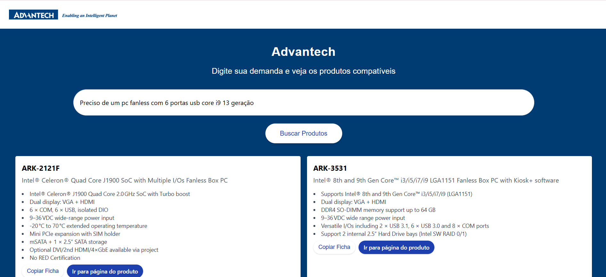

## Projeto desenvolvido com o objetivo de otimizar processos, permitindo conhecer melhor os PCs Advantech e os casos de uso específicos de cada linha.

## Pré-requisitos

- [Python](https://www.python.org/downloads/)  
- [Node.js](https://nodejs.org/)  

Verifique as versões instaladas:

py --version
node -v

## Clonar o Repositório
git clone <URL_DO_REPOSITORIO>

cd <PASTA_DO_PROJETO>

## Configurar o Ambiente Python
- Acesse a pasta principal do projeto:

cd <PASTA_DO_PROJETO>

- Crie um ambiente virtual:

python -m venv venv

- Ative o ambiente virtual:

 venv\Scripts\activate

- Instale as dependências:

pip install fastapi uvicorn pydantic sentence-transformers faiss-cpu numpy

- Para rodar a API FastAPI:

uvicorn main:app --reload

## Configurar e Executar Frontend
- Acesse a pasta do frontend:

cd frontend

- Instale as dependências:

npm install

- Inicie o servidor de desenvolvimento:

npm run dev  
